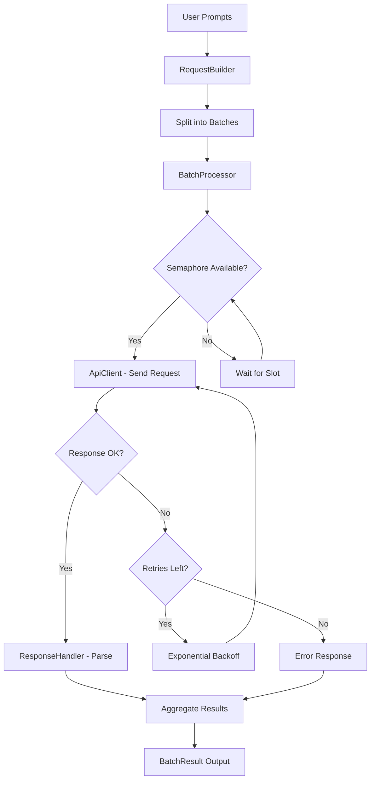

# LLM Batching

An educational Python project demonstrating how to efficiently batch multiple LLM API requests for concurrent processing with rate limiting, retry logic, and structured result aggregation.

## End-to-End Flow Diagram



## Table of Contents

1. [Project Overview](#project-overview)
2. [Project Structure](#project-structure)
3. [Dependencies](#dependencies)
4. [Deployment](#deployment)
5. [Configuration](#configuration)
6. [Usage](#usage)
7. [Testing](#testing)
8. [Docker](#docker)

---

## Project Overview

This project demonstrates the concept of **LLM API request batching** — a technique for efficiently processing multiple prompts by:

- **Grouping** prompts into sized batches to avoid overwhelming the API.
- **Concurrent processing** within each batch using async/await with semaphore-based rate limiting.
- **Retry logic** with exponential backoff for transient failures (5xx errors, timeouts).
- **Structured aggregation** of results with success/failure tracking and token usage statistics.

### Key Concepts Demonstrated

| Concept | Description |
|---------|-------------|
| Batching | Splitting N requests into groups of configurable size |
| Concurrency Control | Semaphore limits simultaneous API calls |
| Retry with Backoff | Exponential delay between retry attempts |
| Async I/O | Non-blocking HTTP calls using httpx |
| Configuration | External YAML config with env var overrides |

---

## Project Structure

```
ai-genai-llm-batching/
├── llm_batching/              # Main application package
│   ├── __init__.py            # Package exports
│   ├── api_client.py          # HTTP client with retry logic
│   ├── batch_processor.py     # Orchestrates the batching pipeline
│   ├── config.py              # Configuration loading and validation
│   ├── logger_setup.py        # Logging configuration
│   ├── main.py                # Application entry point
│   ├── models.py              # Pydantic data models
│   ├── request_builder.py     # Request construction and payload building
│   └── response_handler.py    # Response parsing and result aggregation
├── tests/                     # Unit test suite
│   ├── conftest.py            # Shared test fixtures
│   ├── test_api_client.py     # ApiClient tests
│   ├── test_batch_processor.py # BatchProcessor integration tests
│   ├── test_config.py         # Configuration loading tests
│   ├── test_models.py         # Data model validation tests
│   ├── test_request_builder.py # RequestBuilder tests
│   └── test_response_handler.py # ResponseHandler tests
├── config/
│   └── settings.yaml          # Application configuration file
├── .env.example               # Environment variable template
├── .gitignore                 # Git ignore patterns
├── Dockerfile                 # Container build instructions
├── docker-compose.yml         # Container orchestration
├── pyproject.toml             # Poetry project configuration
└── README.md                  # This file
```

---

## Dependencies

| Package | Purpose |
|---------|---------|
| httpx | Async HTTP client for API communication |
| pydantic | Data validation and serialization |
| pydantic-settings | Configuration management with env var support |
| pyyaml | YAML configuration file parsing |

### Dev Dependencies

| Package | Purpose |
|---------|---------|
| pytest | Test framework |
| pytest-asyncio | Async test support |
| pytest-cov | Code coverage reporting |
| respx | HTTP mocking for httpx |
| ruff | Linting and formatting |

---

## Deployment

### Prerequisites

- Python 3.12 or higher
- Poetry 2.x package manager

### Local Setup

1. **Clone the repository:**
   ```bash
   git clone <repository-url>
   cd ai-genai-llm-batching
   ```

2. **Install dependencies with Poetry:**
   ```bash
   poetry install
   ```

3. **Configure environment variables:**
   ```bash
   cp .env.example .env
   # Edit .env and set your LLM_BATCH_API_KEY
   ```

4. **Run the application:**
   ```bash
   poetry run python -m llm_batching.main
   ```

---

## Configuration

Configuration is loaded from `config/settings.yaml` with environment variable overrides.

### Configuration File (config/settings.yaml)

| Key | Default | Description |
|-----|---------|-------------|
| `api_base_url` | `https://api.openai.com/v1` | LLM API endpoint |
| `api_key` | `""` | API authentication key |
| `batch_size` | `5` | Requests per processing batch |
| `max_concurrent_requests` | `3` | Maximum simultaneous API calls |
| `request_timeout_seconds` | `30.0` | Per-request timeout |
| `max_retries` | `3` | Retry attempts for failed requests |
| `retry_delay_seconds` | `1.0` | Base delay between retries |
| `default_model` | `gpt-3.5-turbo` | Default LLM model |
| `default_max_tokens` | `256` | Default max response tokens |
| `default_temperature` | `0.7` | Default sampling temperature |
| `log_level` | `INFO` | Logging level (DEBUG/INFO/WARN/ERROR) |

### Environment Variable Overrides

All settings can be overridden with environment variables using the `LLM_BATCH_` prefix:

```bash
export LLM_BATCH_API_KEY=sk-your-api-key
export LLM_BATCH_BATCH_SIZE=10
export LLM_BATCH_LOG_LEVEL=DEBUG
```

---

## Usage

### Running the Demo

```bash
poetry run python -m llm_batching.main
```

### Using as a Library

```python
import asyncio
from llm_batching.config import create_config
from llm_batching.batch_processor import BatchProcessor

async def main():
    config = create_config()
    processor = BatchProcessor(config)

    prompts = [
        "Explain quantum computing.",
        "What is blockchain?",
        "Describe machine learning.",
    ]

    result = await processor.process_prompts(prompts)
    print(f"Processed {result.successful_count}/{result.total_requests} successfully")

    await processor.close()

asyncio.run(main())
```

---

## Testing

### Run All Tests

```bash
poetry run pytest
```

### Run Tests with Coverage

```bash
poetry run pytest --cov=llm_batching --cov-report=term-missing
```

### Run Linting

```bash
poetry run ruff check llm_batching/ tests/
```

---

## Docker

### Build and Run with Docker Compose

```bash
# Build the container image
docker-compose build

# Run the application
docker-compose up
```

### Build Manually

```bash
# Build the Docker image
docker build -t llm-batching .

# Run the container with environment variables
docker run --env-file .env llm-batching
```
